<!-- 标题 + 个人描述, emoji 取自: http://emojihomepage.com -->

  <h1 height="200px" align="center">
 Hi , I'm gemdeng
  </h1>
   
🤗 A frontend developer from China 👨‍💻

   
I love 🎥 movies 🎞 ,🛋 reading📖 and 💎 gem 👩‍🎤

  
  
  
  
  
  

  
  
  
  
  
  
  

  
  
  
  
  
  
  
  
  

<!-- 贪吃蛇 - 图片由 actions/Generate Snake 定时生成 -->
<picture>
  <source media="(prefers-color-scheme: dark)" srcset="./assets/github-snake-dark.svg" />
  <source media="(prefers-color-scheme: light)" srcset="./assets/github-snake.svg" />
  
</picture>

<table align="center">
  <tr>
    <td align="center">
      
<b><em><spam>Statistics</spam></em></b>

      
    </td>
    <td align="left">
      
    </td>
  </tr>
</table>

